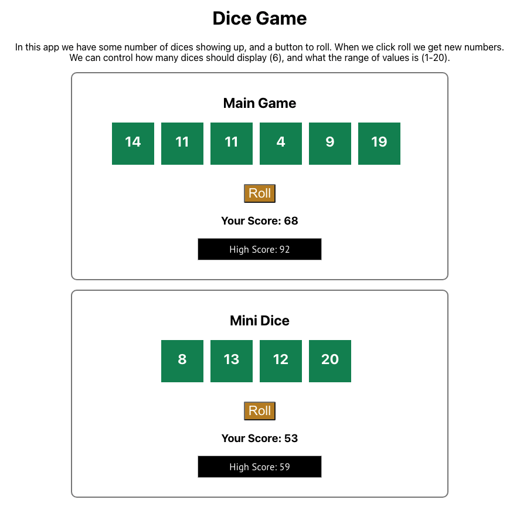

# Dice Game App

This project was bootstrapped with [Create React App](https://github.com/facebook/create-react-app).

In this app we have some number of dices showing up, and a button to roll. When we click roll we get new numbers. We can control how many dices should display (6), and what the range of values is (1-20).

